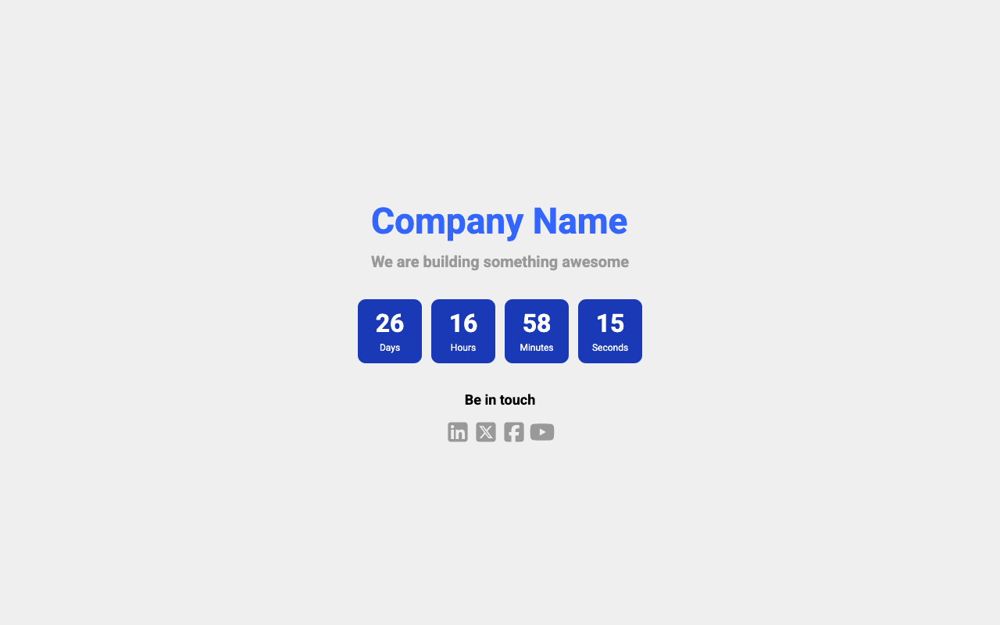

# Coming Soon – Minimal Countdown Page

A clean, minimal **Coming Soon / Maintenance** page built with **pure HTML, CSS, and JavaScript**.  
No frameworks, no build tools — just open, customize, and deploy.

---

## 📸 Preview



---

## ✨ Features

- Minimal, modern, and responsive design
- Countdown timer (days / hours / minutes / seconds)
- Easy to customize (no JavaScript knowledge required)
- SEO-friendly HTML structure
- Works on all modern browsers
- Ready to deploy on any static hosting service

---

## 📁 Project Customization

### 1. Change the target (launch) date

1. Open the following file:
   ```
   assets/js/main.js
   ```

2. Find this line:
   ```js
   const end = new Date("2028-01-10T12:00:00");
   ```

3. Replace the date with your desired launch date:
   - Use ISO format: `YYYY-MM-DDTHH:mm:ss`
   - The date **must be in the future**

4. Save the file — the countdown will update automatically.

---

### 2. Add or remove social media icons

- All social media icons are located in:
  ```
  assets/images/social-media/
  ```

- To **add a new icon**:
  1. Place the SVG file in this folder
  2. Reference it inside `index.html`

- To **remove an icon**:
  - Simply remove its `<a>` or `` tag from `index.html`

---

### 3. Change social media icon color

- Open the SVG file of the icon
- Find this attribute:
  ```svg
  fill="#999999"
  ```
- Replace the color with your desired value (HEX, RGB, etc.)

Example:
```svg
fill="#2563eb"
```

---

### 4. Update text content (title, description, footer)

- Open:
  ```
  index.html
  ```
- You can safely edit:
  - Page title
  - Headings
  - Description text
  - Footer content

No JavaScript changes are required.

---

### 5. Replace logo or images

- Replace the placeholder image inside:
  ```
  assets/images/
  ```
- Keep the same filename **OR**
- Update the `` path in `index.html`

---

## 🚀 Deployment

This project requires **no build step**.  
You can deploy it instantly on:

- GitHub Pages
- Netlify
- Vercel
- Cloudflare Pages
- Any shared hosting

Just upload the files and you’re done.

---

## 🔒 Privacy & Safety

This repository contains:
- No real logos
- No analytics
- No tracking scripts
- No environment variables

All assets are placeholders and safe for public use.

---

## ⭐ Support

If you find this project useful:
- Star the repository ⭐
- Share it with others
